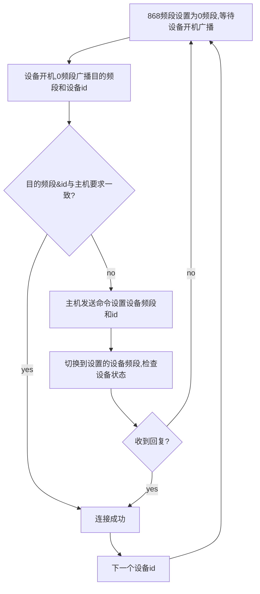

## 仰卧起坐

| 文档版本号： | 1.0      | 文档编号：      |           |
| ------------ | -------- | --------------- | --------- |
| 文档密级：   | 绝密     | 归属部门/项目： | 开发部    |
| 系统名：     | 智能主机 | 子系统名：      |           |
| 编写人：     | 王伟杰   | 编写日期：      | 2018-11-2 |

**文档修订记录**

| **版本号** | **修订日期** | **修订人** | **修订说明** | **修订状态** | **审核日期** | **审核人** |
| ---------- | ------------ | ---------- | ------------ | ------------ | ------------ | ---------- |
|            |              |            |              |              |              |            |
|            |              |            |              |              |              |            |
|            |              |            |              |              |              |            |
|            |              |            |              |              |              |            |
|            |              |            |              |              |              |            |
|            |              |            |              |              |              |            |
|            |              |            |              |              |              |            |
|            |              |            |              |              |              |            |
|            |              |            |              |              |              |            |

修订状态：A--增加，M--修改，D--删除

日期格式：YYYY-MM-DD

### 编写依据

产品需求

| **参考文件**                                                 | **备注** |
| ------------------------------------------------------------ | -------- |
| [仰卧起坐子机通讯协议](./ref/仰卧起坐子机通讯协议V1.2版.doc) |          |

**由于仰卧起坐项目与跳绳项目有很大一部分处理相同,这里主要针对一些区别进行阐述**

### 实现原理

通过无线868模块与仰卧起坐设备进行通讯,协议参考[仰卧起坐子机通讯协议](./ref/仰卧起坐子机通讯协议V1.2版.doc)
> 手柄与主机通讯有3个重要参数:主机号、设备id
> 主机号用于确定868模块与设备最终通讯的频段,其计算方式参考相关无线868模块文档及代码;
> 设备id,当前主机给设备分配的标志id;

### 概要说明

#### 基本流程

同跳绳

#### 设备匹配

在测试前,需要配置用于在当前主机测试的设备,为这些设备分配**设备id**,在配置完成后,在学生检录和测试时,会自动检测这些设备并显示.

手柄匹配有专门的手柄匹配界面,其工作流程大致如下:

> 上述`目的频段`指的是连接成功后,主机和手柄的通信频段,其值与主机号有关
>
> 因为设备开机时的开机广播是在0频段,所以不要多设备同时开机,不然会导致同时对这些设备进行设置为相同的目的频段和id;
>
> 与跳绳不同,仰卧起坐没有冲突检测机制

#### 学生检录

同跳绳

#### 成绩处理

同跳绳

### 主要测试点

同跳绳