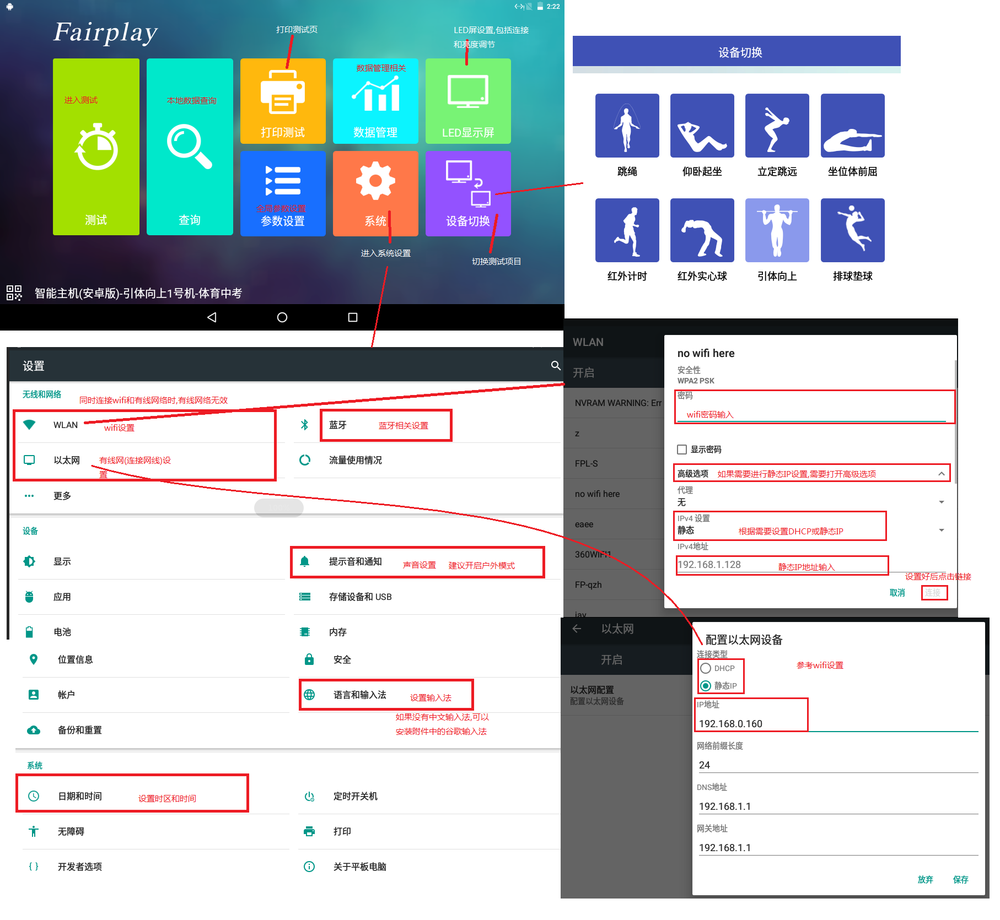
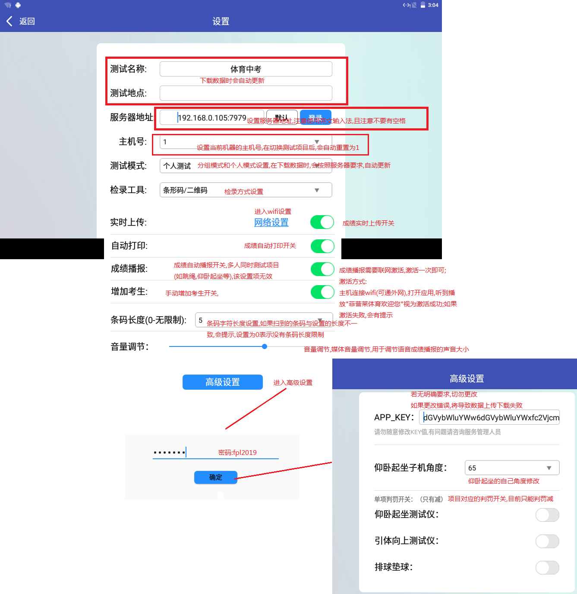

## 安卓机(考试版)使用前配置

| 文档版本号： | 1.0      | 文档编号：      |        |
| ------------ | -------- | --------------- | ------ |
| 文档密级：   | 绝密     | 归属部门/项目： | 开发部 |
| 系统名：     | 智能主机 | 子系统名：      |        |
| 编写人：     |          | 编写日期：      |        |

**文档修订记录**

| **版本号** | **修订日期** | **修订人** | **修订说明** | **修订状态** | **审核日期** | **审核人** |
| ---------- | :----------- | ---------- | ------------ | :----------: | ------------ | ---------- |
| 1.0        | 2019.5.21    | 王伟杰     | 初版         |      A       |              |            |
|            |              |            |              |              |              |            |
|            |              |            |              |              |              |            |

修订状态：A--增加，M--修改，D--删除

日期格式：YYYY-MM-DD

### 编写依据

| **参考文件** | **备注** |
| ------------ | -------- |
|              |          |

### 概要说明

安卓智能主机(以下称安卓机),是用于替换之前老版的控制主机而研发的通用控制主机:

1. 包含老版控制主机的大部分可用功能;
2. 一台主机可以用于测试多个项目;
3. 数据操作更加简单,快捷,没有数据容量限制;
4. 集成打印和语音播报(需连接网络激活);
5. 集成多种检录方式,包括IC,身份证,扫码和指纹等;

该文档用于描述:

> 在通过安卓主机进行测试之前,需要进行的设置;

### 安卓机使用前设置

包括:

1. 网络设置:wifi设置,有线网络设置;
2. 时区,时间设置;
3. 输入法设置;
4. 蓝牙设置;
5. 全局参数设置:包括服务器相关,检录方式,主机号,打印和条码长度等;

具体参考下列图片:

**全局参数设置:**

> 安卓机与后台服务器的交互需要有账户名和密码,相关内容具参考附件:[安卓机(考试版)服务器配置说明.doc](./安卓机(考试版)服务器配置说明.doc)

