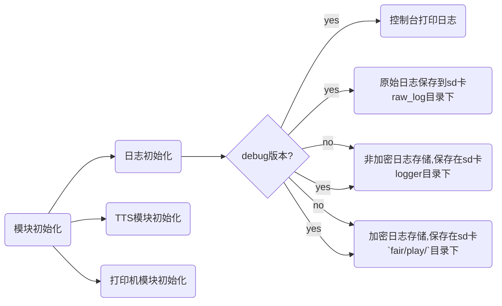
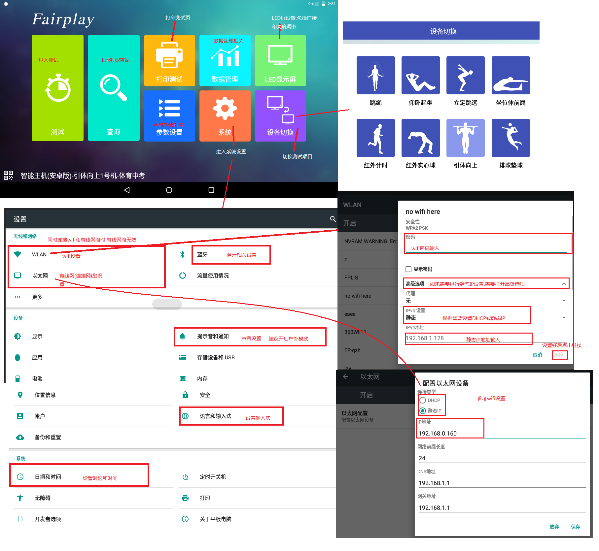

本文档对应用的整体流程进行一个阐述,提供用户使用应用的基本流程和内部实现;

#### 编写时间轴

|        时间         |   版本   | 修改内容 | 修改人 |
| :-----------------: | :------: | :------: | :----: |
| `2018-10-15`|  `V1.0` | 新建文档 |  王伟杰  |        |

#### 编写依据

- [产品需求](./ref/智能主机项目1.3原型演示.exe)

#### 应用整体流程

~~~flow
st=>startTime: 应用启动
welcome=>operation: 进入欢迎界面,进行模块初始化
main=>operation: 主界面
led=>operation: 显示屏
setting=>operation: 通用设置
systerm=>operation: 系统设置
printer=>operation: 打印设置
data=>operation: 数据
retrieve=>operation: 查询
project_select=>operation: 测试项目选择
test=>operation: 测试流程

st->welcome->main->project_select->test
~~~


#### 各个流程的具体内容

##### 欢迎界面&模块初始化

在应用启动的时候,应用进入欢迎界面,显示欢迎信息,同时后台进行模块初始化,模块初始化完成后,从欢迎界面跳转到主界面.

模块的初始化包括的内容包括如下所示:



> 上述所有保存到sd的日志,文件名为:`年_月_日_时_分_秒.txt`
>
> 加密日志,使用的是DES加密形式
>
> 在正式版本(release版本时,只有在sd卡中会保存日志),开发人员需注意在release版本上的调试
>
> 保存到sd卡上的加密和非加密日志,内容都是开发人员主动使用Logger.xxx()方式打印,不含系统自带日志
>
> 串口与数据库的初始化为延迟加载模式,在需要使用的时候进行加载,相关初始化查看相关文档

##### 主界面

主界面显示内容如下:

主界面主要包括如下内容模块:

1. 设置:所有项目的通用设置项
2. 打印:打印相关设置,具体待机器出来后再处理
3. 显示屏:LED显示屏相关设置
4. 系统:跳转到系统设置
5. 查询:数据查询相关,具体查看数据库相关文档
6. 数据:数据管理相关,具体查看数据库相关文档
7. 设备切换:选择设备和项目
8. 右上角显示sd卡剩余存储空间
9. 测试:开始测试流程

上述大部分功能很直观,这里主要阐述测试相关流程,在进入测试流程之前,当前的测试项目必须被设置,如果没有设置测试项目,那么app会自动引导用户到相关设置,这个操作与用户手动点击"设备切换"按钮效果一致.

~~~flow
main=>operation: 主界面
isProjectSet=>condition: 测试项目已设置?
test=>operation: 测试流程
project_select=>operation: 测试项目选择

main->isProjectSet
isProjectSet(yes)->test
isProjectSet(no)->project_select
~~~

> 除了测试流程外,在主页进入显示屏设置、数据管理和查询、设置界面均需要提前设置测试项目，都需要走类似上述的流程

设备切换:包含两个方面:机器选择和项目选择,先选机器,后选项目,一个机器可能对应多个项目(历史遗留设计,必须保留,用于确定项目的机器码和项目代码)

在选择了项目之后,会将该选择保存在本地,下次进入应用时,会默认选择该选项

```flow
machine_select=>operation: 测试机器选择
project_select=>operation: 测试项目选择

machine_select->project_select
```

##### 测试流程

这里的只是总体测试流程,具体部分流程,请查看相关流程文档;

总体的测试流程如下:

```flow
st=>startTime: 检录
test=>operation: 测试,从测试终端获取测试成绩
deal_result=>operation: 测试成绩处理
end_test=>end: 测试结束

st->test->deal_result->end_test
end_test->st
```

上述流程图:

1. 检录相关参考检录文档，具体项目文档应该对检录模式(单人检录、组检录等)进行基本解释;
2. 测试,因为涉及到不同的项目有不同的测试设备和测试协议,具体文档参考相关项目的测试文档;
3. 测试成绩处理,参考成绩处理相关文档,如果个别项目存在与一般成绩处理不同的流程/机制,在相关文档中标明;
4. 测试结束,开始下一次检录;

### 主要测试点

1. 测试项目选择(含自动选项保存等);
2. 通用设置各选项有效性;
3. 数据查询及检索等的正确性,具体查看数据库相关文档;
4. 打印,显示屏设置等有效性;

