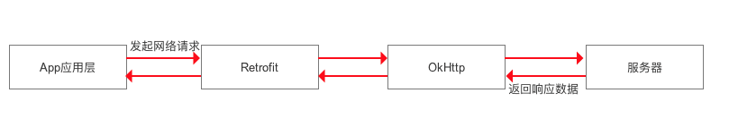
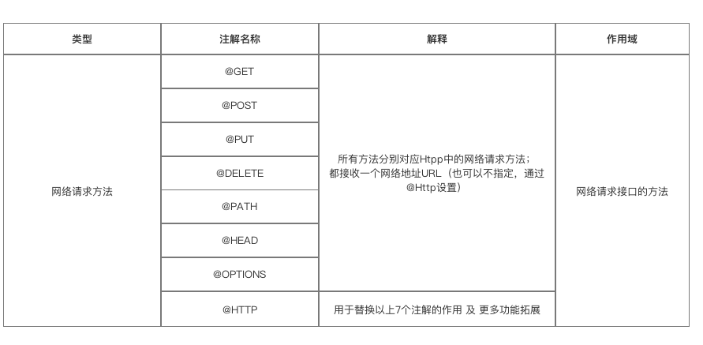
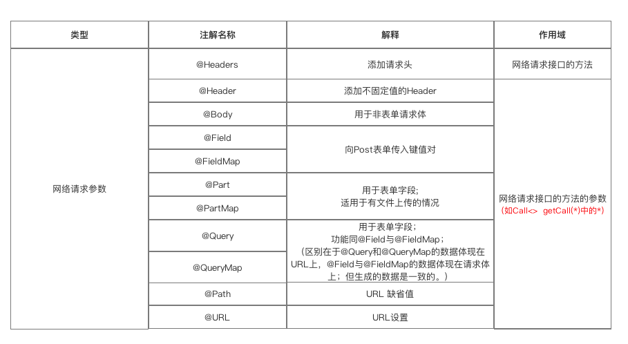

# 智能主机 （网络框架）

详细设计说明书

| 文档版本号： | 1.0      | 文档编号：      |                    |
| ------------ | -------- | --------------- | ------------------ |
| 文档密级：   |          | 归属部门/项目： |                    |
| 系统名：     | 智能主机 | 子系统名：      | 智能主机（体测版） |
| 编写人：     |          | 编写日期：      | 2018-10-15         |

[TOC]


## 1概述

### 1.1 编写目的

​	智能主机客户端（网络框架）根据 服务器接口协议进行开发。由于原版网络接口层次不够清晰，先采用最新流行的网络框架，重新编写。

​	网络框架采用 Rxjava2+Retrofit2 + OKhttp的框架，将网络请求与结果获取进行分层处理。

### 1.2 适用范围

​	Android 客户端所有的HTTP1.1协议的所有请求。同时需要添加权限。如果需要添加网络权限 ，使用缓存需要添加文件存储权限。

​	Android 系统6.0 及以上缓存文件存储需要动态授予使用文件权限。

​	关于权限的处理建议使用 这个开源框架。https://www.yanzhenjie.com/AndPermission/。 

### 1.3 术语和缩写

| **术语和缩写** | **解释** | **备注** |
| -------------- | -------- | -------- |
|                |          |          |
|                |          |          |

### 1.4 参考资料

| **参考文件** | **开源地址**                        |
| ------------ | ----------------------------------- |
| Rxjava       | https://github.com/ReactiveX/RxJava |
| Retrofit     | https://github.com/square/retrofit  |

## 2 角色和职责

| **角色**   | **职责** |
| ---------- | -------- |
| 项目经理   |          |
| 系统分析员 |          |

## 3 设计约定

文档设计接口与后台接口相对接 

接口文档      [接口设计2018-5-14.doc](./ref/接口设计(修改版).doc)

###  3.1请求接口 

| **参数名** | **参数说明**         | **类型** | **必填** | **备注** |      |
| ---------- | -------------------- | -------- | -------- | -------- | ---- |
| signature  | 接口签名             | String   | 是       |          |      |
| parameData | 对象                 | Object   | 是       |          |      |
| token      | 绑定成功时返回的令牌 | String   | 是       |          |      |
| dateTime   | 当前时间戳（13位）   | String   | 是       |          |      |

###  3.2 返回接口

接口设计文档返回的Json 字符串返回格式如下:

> {
>
> ​	“resultState”：0,
>
> ​	“msg”:”执行成功”，
>
> ​	“body”:null
>
> }

所有的网络请求将按照这个约定进行对接。

## 4 实现框架及功能逻辑

###  4.1 功能逻辑描述

网络框架分为retrofit代理 网络请求和结果集处理三块，为了对文件下载进度监听单独设定一个下载模块。

### 4.2 软件体系架构





## 5 详细设计

### 5.1概要说明

框架基于retrofit rxjava OKHTTP gson框架因而需添加 这三个框架

```
compile 'io.reactivex.rxjava2:rxjava:2.1.9'
compile 'io.reactivex.rxjava2:rxandroid:2.0.2'
compile 'com.squareup.retrofit2:retrofit:2.3.0'
compile 'com.squareup.retrofit2:adapter-rxjava2:2.3.0'
compile 'com.squareup.retrofit2:converter-gson:2.3.0'
compile 'com.squareup.okhttp3:logging-interceptor:3.8.1'
compile 'com.squareup.okhttp3:okhttp:3.8.1'
compile 'com.squareup.okio:okio:1.13.0'
compile 'com.google.code.gson:gson:2.7'
```

 

### 5.2 实现框架 

#### 5.2.1 类描述 

#####  HttpManager 	

​	单例类创建httpClent请求并设置如连接时间，超时时间。设置头信息。构建retrofit ，设定为gson转换javaBean 设置 baseURL  

#####  HttpResult 

​	根据后台约定 设定返回结果集。resultState msg 及泛型 body。

##### RequestSub

​	此处是利用rxjava2的观察者模式的框架继承DisposableObserver 。观察结果的返回。并通过构造方法可设定是否需要添加progressDialog ，以及取消请求。

##### OnResultListener

​	结果的接口返回，结果成功与失败的监听。

##### ProgressCancelListener 

​	请求和取消的监听接口

**URLConstant**

​	设定请求常量

**HttpApi**

​	retrofit 的网络请求的协议。包含注解和返回。

####  5.3 使用方法 

1. 设置URLConstant设定baseURL。注意retrofit2 规定**baseURL一定要以/结尾**。

2. 在HttpApi类中创建需要的请求如请求为  baseURL+getUser那根据和后台的约定
   使用相对应的注解和对应的返回结果。

3. 为了方便分层可以创建一个类如 UserSubscriber单独处理请求，以方便调用。如：

   ```java
   public static void queryCus(HashMap<String,Object> map, DisposableObserver subscriber){
   
           Observable<HttpResult<Customer>> observable = HttpManager.getInstance().getHttpApi().queryCus(map);
           HttpManager.getInstance().toSubscribe(observable, subscriber);
       }
   ```

4. 调用 

   ```java
   // Context context 若需要使用progress则传入context ，否则不需要
   UserSubscriber.queryCus(queryCus,new RequestSub(new OnResultListener<Customer>() {
   
               @Override
               public void onSuccess(Customer result) {
                   Log.i("result","---------------"+result.toString());
               }
   
               @Override
               public void onFault(String errorMsg) {
                   Log.i("errorMsg",errorMsg);
               }
           },context));
   ```

#### 5.4 文件下载

不需要使用进度条的下载见API

针对需要进度条的文件下载可在download包中调用DownloadUtil 注意 URL 传入全路劲如： http://localhost:8080/123.png

```java
public void downloadFile(String url, final DownloadListener downloadListener) {}
```

#### 5.5 说明 

##### 5.5.1retrofit 请求方法图



##### 5.5.2 特别注意：在测试中发现body并不能成功

根据retrofit 的文档 请求参数如下。



##### 5.5.3 根据协议的做封装使调用简单如下

例子：请求参数的paramData 如下 

| **参数名**     | **参数说明**        | **类型** | **必填** | **备注**           |
| -------------- | ------------------- | -------- | -------- | ------------------ |
| token          | 设备绑定是返回token | String   | 是       |                    |
| MachineCode    | 机器码              |          |          |                    |
| MachineNumber  | 主机号              |          |          |                    |
| testItemResult | 体测项目成绩        | String   | 否       | 考试该字段为null   |
| examItemResult | 考试项目成绩        | String   | 否       | 体测时该字段为null |
| remark         |                     |          |          |                    |

根据协议 需要的参数如下 

```java
queryCus.put("parameData", paramData );
queryCus.put("signature","her");
queryCus.put("token","token");
queryCus.put("dateTime","2018");
```

因为signature token dateTime 是常量或可以计算，所可以再做封装如下。

```java
HashMap<String,String> query = new HashMap<>();
        query.put("parameData", CommonUtils.getParamData(object));//customer
        query.put("token", MyApplication.TOKEN);
        query.put("dateTime",System.currentTimeMillis()+"");
        query.put("signature",CommonUtils.getSignature(query));
```

最后调用只需要传入 paramaData 的值就可以 parama可以是hashMap Bean对象或String 字符串。

## 6 Rxjava 使用方法API 见简书地址

https://www.jianshu.com/p/0cd258eecf60

