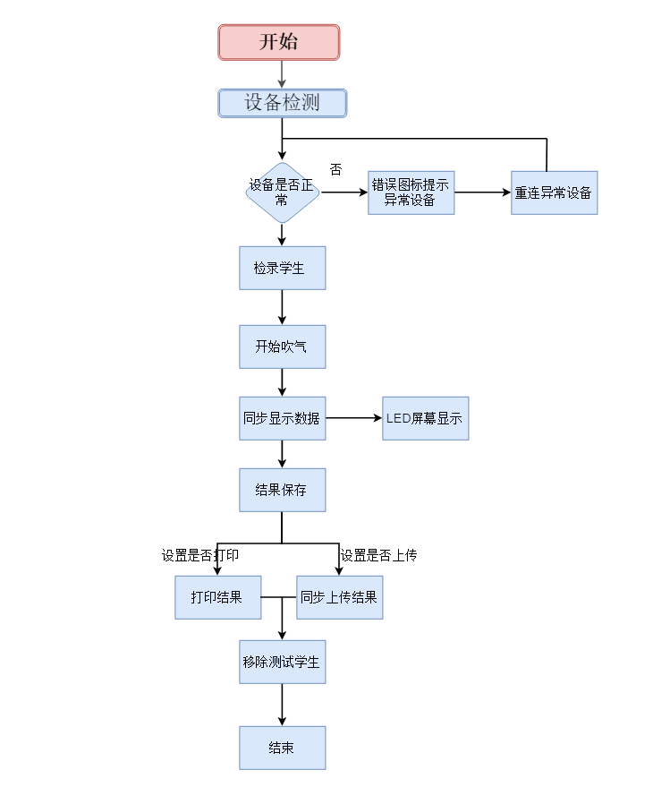
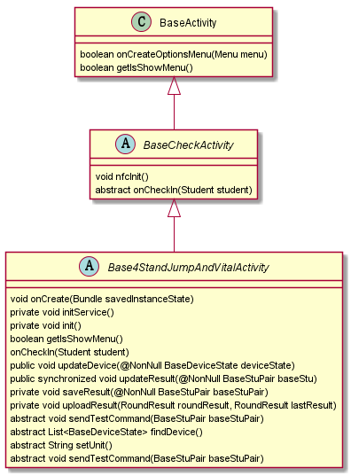
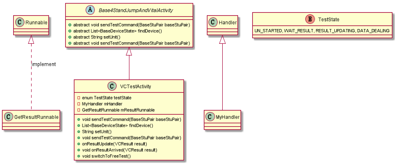

# 智能主机(肺活量)设计说明书

详细设计说明书

| 文档版本号： | 1.0      | 文档编号：      |                    |
| ------------ | -------- | --------------- | ------------------ |
| 文档密级：   |          | 归属部门/项目： |                    |
| 系统名：     | 智能主机 | 子系统名：      | 智能主机（体测版） |
| 编写人：     |          | 编写日期：      | 2018-10-15         |


[TOC]

# 1 **概述**

## 1.1 **编写目的**

 智能主机客户端（肺活量）为方便使用人员方便使用，测试进行编写。

 

## 1.2 **适用范围**

《智能主机（肺活量）详细设计说明书》只适用于智能主机项目Android客户端。使用需配合肺活量测量仪器，与串口转换器，一并使用。

 

## 1.3**参考资料**

| **参考文件**   | **备注**                                             |
| -------------- | ---------------------------------------------------- |
| 安卓转换器协议 | [安卓转换器协议1.2.doc](/ref/安卓转换器协议v1.2.doc) |

 

# 2 **角色和职责**

| **角色**   | **职责**                     |
| ---------- | ---------------------------- |
| 项目经理   | l 指导和审查数据库的详细设计 |
| 系统分析员 | l 负责数据库的详细设计       |

 

# 3 **设计约定**

安卓主机肺活量数据根据协议规定读取串口数据，并进行解析。同时发送数据。

协议如下：

主机下发查询命令，格式：0xaa 0xc1 0x00 0x00 0xc1

终端上报数据命令，格式：0xaa 0xd0 d1 d2 sum。d1 d2分别是数据的高低字节，sum是0xd0+d1+d2的累加和。

# 4  **功能描述**

智能主机客户端（肺活量）分为学员测试与自由测试，为学员提供智能获取考生成绩，上传成绩云端保存等多项服务。同时检测测量仪器是否正常。正常安卓屏幕会显示为正常状态，否则为异常状态。


# 5 详细说明

### 5.1 流程图

业务流程主要是设备的检测 ，检录人员 ，测试人员吹气 ，结果处理。



### 5.2 程序说明


#### 5.2.1 公共界面uml图

uml图



 Uml图说明 

baseActivity 主要给子类提供是否加载菜单的功能接口。

BaseCheckActivity 继承自baseActivity 该类提供了NFC扫描功能，并提供了抽象方法，在扫描到信息时的处理。交给子类去处理。

Base4StandJumpAndVitalActivity 继承自 BaseCheckActivity 该类提供了一个公共的界面，为测试立定跳远，肺活量，实心球，坐位体前屈界面。并提供了更新设备信息，测量结果，上传结果，等方法。

####  5.2.2 公共界面方法说明(个人测试模版基类)

见  [](./个人测试模版基类（BasePersonTestActivity）.md)

### 5.3 肺活量界面

####    5.3.1  测试流程uml图

```flow
startTime=>startTime: 检录
isHaveDevice=>condition: 是否有设备可添加
wait=>operation: 等待检录
add=>operation: 添加测试人员
test=>operation: 开始测试
result=>operation: 结果处理(led显示结果，语音播报，更新设备状态，保存上传设备状态)
end=>end: 完成
startTime(right)->isHaveDevice
isHaveDevice(no)->wait->add
isHaveDevice(yes)->add
add->test->result->end
```


​	进入肺活量测试界面，程序所做的工作为

1、 进行串口连接，也就是得到SerialManager ，

2、 得到串口后可以开始语音播报开始测试

3、 建立一个轮询 每100ms 发送向串口发送请求肺活量数据， 并将状态设定为 WAIT_RESULT

4、 通过handler进行接收数据源，获取到数据后开始处理也就是图中的 VITAL_CAPACITY_RESULT ，此时开始判断状态.

5、 如果是 WAIT_RESULT 根据数据源得到肺活量数据，更新设备状态，并将状态更改为RESULT_UPDATETING ,如果是RESULT_UPDATETING 

此时需要做判断是否吹气结束，此处做的一个是或得到肺活量数值降低，如果变少那么是吹气结束，或者是换气了，此时锁定结果。如果连续5次以上结果值一样，也认为是吹气结束，锁定结果，更新数据，更改状态。

6，更新数据，更改设备状态等操作均交由公共界面的方法处理。

#### 5.3.2 类uml图



1、  VCTestActivity 继承自Base4StandJumpAndVitalActivity ，并实现了Base4StandJumpAndVitalActivity 的抽象方法 sendTestCommand ,findDevice,setUnit 。

因为需要程序可能会更具后台接收数据而改变项目的不同，所以需要手动更改测试单位需要setUnit。

2、GetRunnalble 是VCTestActivity的内部类，并实例化Runnable 的run方法，进行一个轮询操作，每隔100ms 发送获取肺活量数据指令。

3、enum TestState 用于改变当前状态，并根据不同状态做数据更新处理

4、MyHandler是继承自Handler 用于接收串口数据并处理。根据状态的不同，做设备更新，数据刷新操作。

# 6 测试

等待检录--> 检录--->测试---> 结果上传

#### 6.1 注意 当设备状态为红色时说明设备异常。

#### 6.2 程序过滤掉了300ml的数据。

​	因为设备在无人吹气的情况下仍然能够通过自然吸气，得到数据。为防止无效数据，程序过滤掉了300ml以下的数据。

