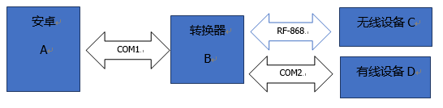
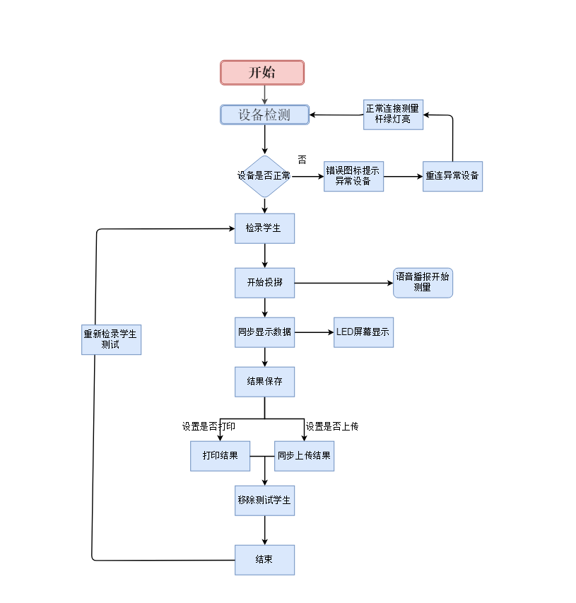
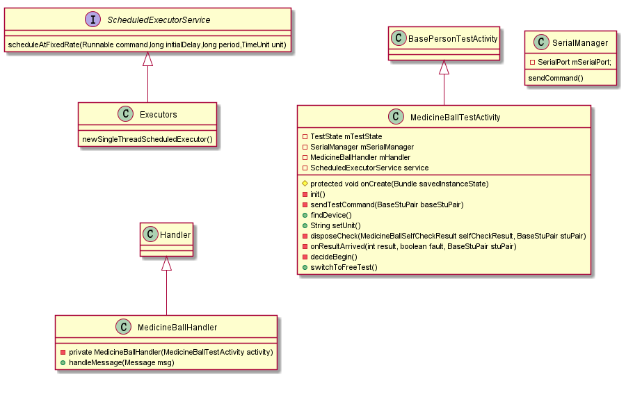
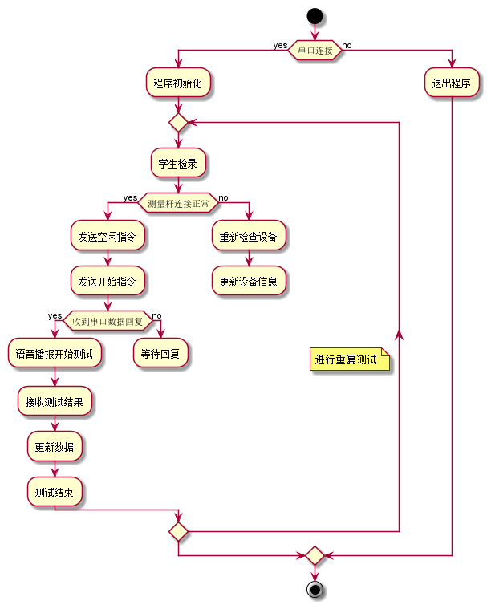

# 智能主机（红外实心球）

详细设计说明书

| 文档版本号： | 1.0      | 文档编号：      |                    |
| ------------ | -------- | --------------- | ------------------ |
| 文档密级：   |          | 归属部门/项目： |                    |
| 系统名：     | 智能主机 | 子系统名：      | 智能主机（体测版） |
| 编写人：     |          | 编写日期：      | 2018-10-15         |

[TOC]

# 1 **概述**

## 1.1 **编写目的**

 智能主机客户端（红外实心球）根据《智能主机（红外实心球）详细设计说明书》进行开发。

 

## 1.2 **适用范围**

《智能主机（红外实心球）详细设计说明书》只适用于智能主机项目Android客户端的开发。

 

## 1.3 **参考资料**

| **参考文件** | **备注** |
| ------------ | -------- |
|              |          |

 

# 2 **角色和职责**

| **角色**   | **职责** |
| ---------- | -------- |
| 项目经理   |          |
| 系统分析员 |          |

 

# 3 **设计约定**

安卓主机红外实心球数据根据协议规定读取无线连接转换器数据，并进行解析。同时可发送数据。

协议规定如下：

【0:1】包头，2字节,即0XA5,0X5A

【2】命令字=D1，1字节

【3】数据长度=N，1字节，0<N<256

【4:3+N】数据

【4+N】校验和，1字节，=sum{2:3+N}取余

【5+N:6+N】包尾2字节0xaa,0x55

交换模式图：(红外采用RF-868)

# 4  **实现架构及功能逻辑**

### 4.1 **功能逻辑描述**

智能主机客户端（红外实心球）分为学员测试与自由测试，为测试人员提供智能测量投掷实心球成绩，上传成绩云端保存等多项服务。 

### 4.2 **软件体系架构**

# 5 详细说明

### 5.1 业务流程

业务流程主要是设备的检测 ，检录人员 ，测试人员投掷实心球 ，开始测试，结果处理。

### 5.2 检录测试流程图

### 5.3 程序说明

此安卓程序采用的是串口连接读取测量主控杆的数据，开始测量与接收测量是主动式的发送命令，测试结果属于被动式接收。为保证连接有效，有一个空闲命令，经测试发现空闲命令只能在开始测试前发送，**若开始测试后发送空闲命令，会导致无法接收到测试结果**。此外为保证能继续测试可以在测试结束后，再发送一次空闲命令。因为空闲命令发送后，会有自检结果返回，经测试发现自检结果是每4s返回一次。

### 5.4 界面说明

#### 5.4.1 公共界面 

见 [个人测试模版基类](./个人测试模版基类（BasePersonTestActivity）.md)

### 5.5 控制界面

此类属于控制类，将接收来自串口数据，发送命令。实现对实心球的测量，及数据返回，设备状态的反馈。并作出相应的控制动作。

#### 5.5.1 类uml图

#### 5.5.2 方法说明

控制类主要做查找设备，发送控制指令，接收设备返回信息，调用主界面的更新设备信息，成绩的方法。

MedicineBallTestActivity 控制类 继承自BasePersonTestActivity 

mSerialManager 串口管理器，可设置handler ，接收发送数据与串口进行通信，并用handler 传递消息。

ScheduledExecutorService  初始化进行循环查询设备状态，因为并不清楚合适开始测试，与设备状态是否冲突，所以轮询查找匹配。

mHandler 继承自Handler 用以接收串口数据，然后做更新处理

init() 做初始化串口管理器。

findDevice() 实现

setUnit()为方便灵活设置了一个单位

disposeCheck 自检结果处理，用于判断设备是否正常，并做更新，及相关处理

decideBegain()判断是否开始测试

switchToFreeTest()跳转到自由测试

## 6 测试

#### 6.1测试过程

如下图所示 等待检录--> 检录--->测试---> 结果上传

##### 6.1.1注意   

检录完测试人员后，可根据设备状态颜色，判断测量杆是否正常，若正常则可进行测试，否则将会提示，出现错误提示，并语音播放测量杆连接异常。

#### 6.2 测试示意图

