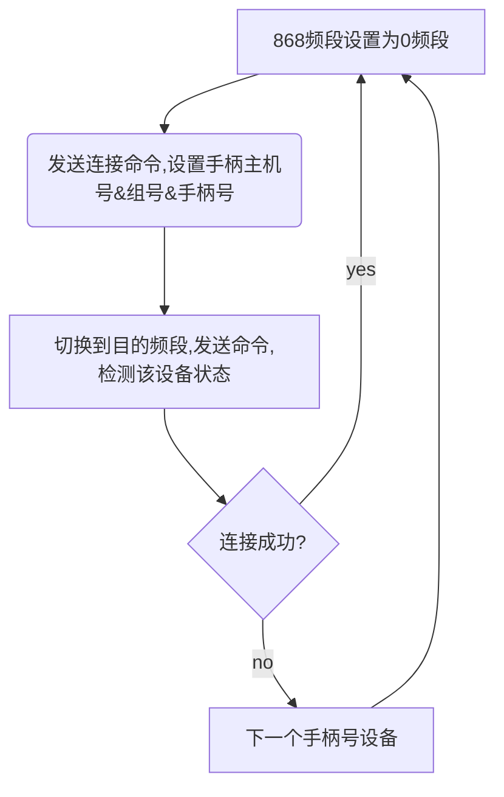
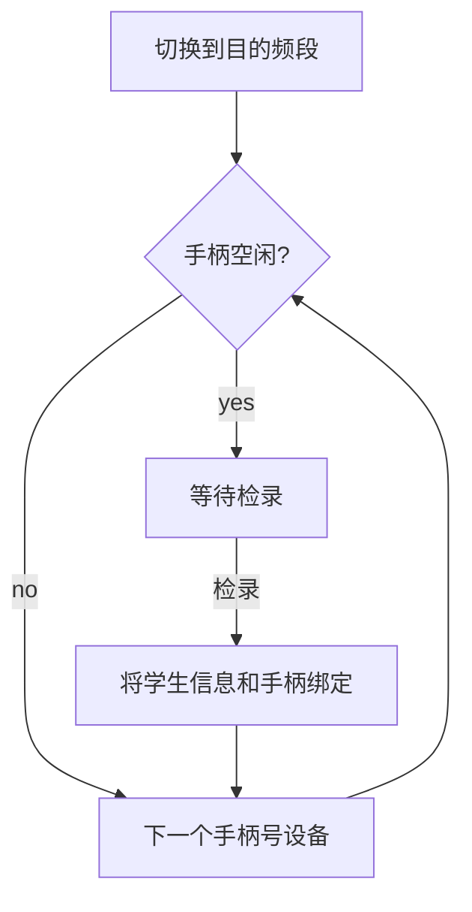
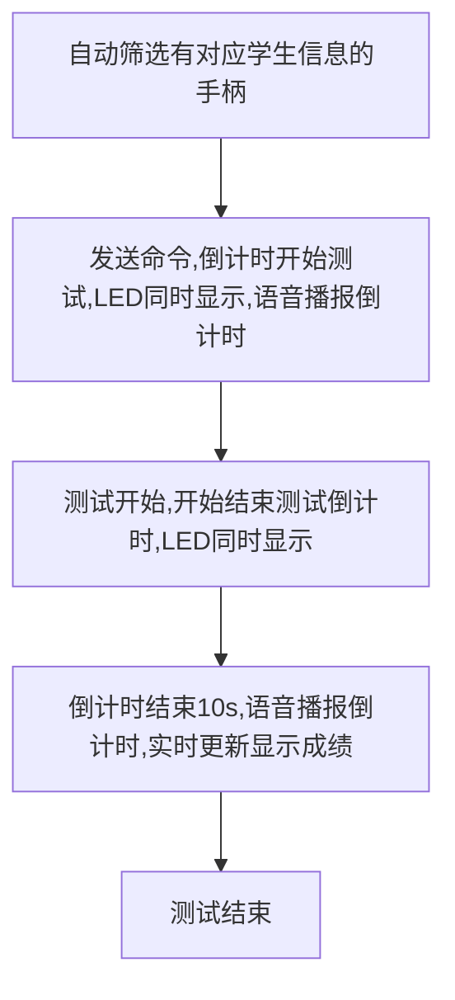

## 跳绳


| 文档版本号： | 1.0      | 文档编号：      |           |
| ------------ | -------- | --------------- | --------- |
| 文档密级：   | 绝密     | 归属部门/项目： | 开发部    |
| 系统名：     | 智能主机 | 子系统名：      |           |
| 编写人：     | 王伟杰   | 编写日期：      | 2018-11-2 |


**文档修订记录**

| **版本号** | **修订日期** | **修订人** | **修订说明** | **修订状态** | **审核日期** | **审核人** |
| ---------- | ------------ | ---------- | ------------ | ------------ | ------------ | ---------- |
|            |              |            |              |              |              |            |
|            |              |            |              |              |              |            |
|            |              |            |              |              |              |            |
|            |              |            |              |              |              |            |
|            |              |            |              |              |              |            |
|            |              |            |              |              |              |            |
|            |              |            |              |              |              |            |
|            |              |            |              |              |              |            |
|            |              |            |              |              |              |            |

修订状态：A--增加，M--修改，D--删除

日期格式：YYYY-MM-DD

### 编写依据

产品需求

| **参考文件**                                         | **备注** |
| ---------------------------------------------------- | -------- |
| [跳绳协议](./ref/跳绳协议.doc)                       |          |
| [868无线模块协议汇总](./ref/868无线模块协议汇总.doc) |          |

### 实现原理

通过无线868模块与跳绳手柄进行通讯,协议参考[跳绳协议](./ref/跳绳协议.doc)和[868无线模块协议汇总](./ref/868无线模块协议汇总.doc);
> 手柄与主机通讯有3个重要参数:主机号、手柄组号和手柄号
> 主机号用于确定868模块与手柄最终通讯的频段,其计算方式参考相关无线868模块文档及代码;
> 手柄组号是手柄的组表示,一次测试时,主机只会与指定组的手柄通讯;
> 手柄号,手柄在组内的标识号;

### 概要说明

#### 基本流程

```flow
pair=>start: 手柄匹配
checkIn=>operation: 学生检录
startTest=>operation: 测试
dealResult=>operation: 成绩处理

pair->checkIn->startTest->dealResult
```

#### 手柄匹配

在测试前,需要配置用于在当前主机测试的手柄,为这些手柄分配**手柄组号**及**手柄号**,在配置完成后,在学生检录和测试时,会自动检测这些手柄并显示.

手柄匹配有专门的手柄匹配界面,其工作流程大致如下:



> 上述`目的频段`指的是连接成功后,主机和手柄的通信频段,其值与主机号有关

#### 学生检录

关于检录基础,查看检录相关文档.

跳绳的学生检录是将指定学生与指定手柄进行1-1配对绑定的过程,其大致流程如下:



由上述可以看出来,检录学生信息时,会自动跳过状态不是空闲的手柄.

**手柄空闲和断开连接状态判断方式**

循环向当前所有设备发送状态检测命令,连续3次,收到回复状态为空闲的即为空闲->其他的(回复状态为非空闲的或没有收到回复的)均视为断开连接

> 之所以这里连续发送3次之后再统计手柄状态:
>
> 如果只对一个手柄发送一次状态检测命令,如果有些信号丢失了或者回复暂时没有收到,会导致状态波动,状态更新频繁;

**手柄冲突检测**

新版跳绳添加了手柄冲突检测机制,每个手柄都有唯一的设备出厂`id`号,如果收到的设备状态回复中,其`id`与已连接的`主机号`、`组号`和`手柄号`的设备的`id`不一致,则认为其为另一个设备,此时认为出现了手柄冲突,用户可以在界面点击出现冲突的手柄,选择绑定冲突的设备`id`中的其中一个;

> 新版跳绳协议兼容老版跳绳协议;
>
> 默认所有老版跳绳的设备出厂`id`均为0;
>
> 调试过程中发现,手柄冲突检测严重依赖冲突的手柄离主机的远近关系,离主机更近的手柄通常会将更远的手柄信号给覆盖掉,导致手柄冲突检测机制失效;

**暂停使用**

可以暂停使用指定手柄,之后将不会处理该手柄的状态信息;

#### 测试

检录完成后,测试流程如下:



> 只要一个手柄有对应的学生信息,不管手柄状态如何,都会将其筛选进入测试范围,该项不得不如此执行:
>
> 因为手柄状态在任何时候都有可能发生变化,所以手柄的变化不能被视为能否测试的依据,如果某个手柄出现故障不能测试,可以通过`故障更改`来更换手柄,或者`删除`来删除手柄对应的学生;
>
> 实时更新显示成绩:
>
> 1. 主机上每次收到成绩均更新成绩显示;
> 2. LED屏幕滚动显示考生成绩信息,每`1s`更新1次;
>
> 测试结束的判断条件:
>
> 测试结束倒计时结束时,并不能立即停止测试,因为这时成绩有很多还没有收到,或者收到了但是没有来得及处理,所以,需要对收到的每个手柄的状态信息进行判断,只有所有手柄都不在`正在计时`状态(可能是测试结束状态或者断开连接状态),才认为所有手柄的最终成绩都收到了,这时结束测试;

测试过程中也可以通过响应按钮进行`暂停使用`,`重新开始`和`停止测试`功能;

#### 成绩处理

成绩处理流程参考成绩处理流程相关文档

成绩处理过程中,LED仍然会继续轮播成绩,知道用户手动退出成绩处理界面.

所有参与测试的手柄成绩都会被当做最终成绩处理,包括暂停使用的手柄和连接断开的手柄

### 主要测试点

1. 手柄配对流畅度;
2. 正常测试检录流程,手柄冲突检测机制;
3. 手柄状态显示正确性;
4. LED实时显示更新;
5. 测试过程中的异常情况,如重新开始测试是否会出现部分手柄没有重新开始,测试过程中,手柄断开是否影响其他手柄等;